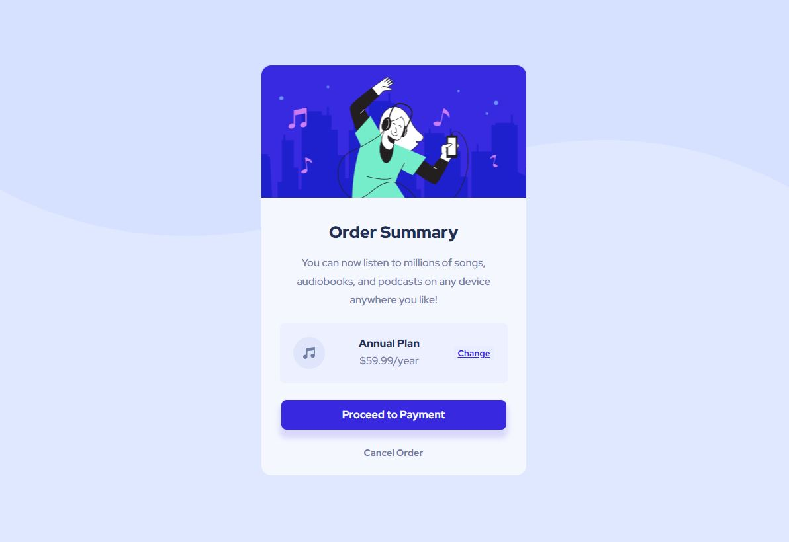

# Frontend Mentor - Order summary card solution

This is a solution to the [Order summary card challenge on Frontend Mentor](https://www.frontendmentor.io/challenges/order-summary-component-QlPmajDUj). Frontend Mentor challenges help you improve your coding skills by building realistic projects. 

## Table of contents

- [Overview](#overview)
  - [The challenge](#the-challenge)
  - [Screenshot](#screenshot)
  - [Links](#links)
- [My process](#my-process)
  - [Built with](#built-with)
  - [What I learned](#what-i-learned)
  - [Continued development](#continued-development)
  - [Useful resources](#useful-resources)
- [Author](#author)

## Overview

### The challenge

Users should be able to:

- See hover states for interactive elements

### Screenshot

### Links

- Solution URL: [https://github.com/aszcoding/Order-Summary-Component]
- Live Site URL: [Add live site URL here](https://your-live-site-url.com)

## My process
I started with the mobile design first, added the active states, and coded the media queries last.

### Built with

- Semantic HTML5 markup
- Flex
- Mobile-first workflow
- Box Glow

### What I learned

I became more familiar with box glow/box shadow through this project.

### Continued development

I'm going to look more into box glow and box shadow properties to become more familiar with them for future projects.

### Useful resources

- [CodersBlock](https://codersblock.com/blog/creating-glow-effects-with-css/) - This helped me understand how to create a slight glowing effect along the bottom of the "Proceed" button.

## Author

- LinkedIn - [Ashley Serrano-Ziel](https://www.linkedin.com/in/ashley-serrano-ziel-375bb0b1/)
- Frontend Mentor - [@aszcoding](https://www.frontendmentor.io/profile/aszcoding)

